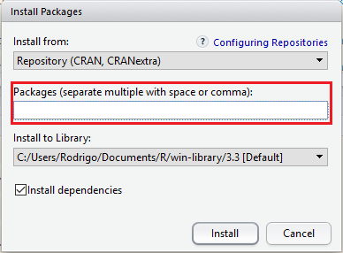
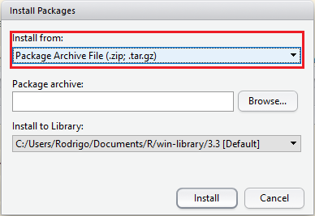

# (APPENDIX) Apêndice {-}

# Uma breve introdução ao R

O `R` é uma linguagem de programação desenvolvida para manipulação de dados, análise estatística e visualização de dados. Algumas características que diferenciam o `R` de outras ferramentas de análise de dados podem ser destacadas: é desenvolvido por estatísticos, é um *software* livre e é extensível via **pacotes**.

`R` é a versão livre, de código aberto, e gratuita do `S`. Nos anos 1980 o `S` foi desenvolvido nos Laboratórios Bell, por John Chambers, para análise de dados e geração de gráficos [REF]. O `R` foi inicialmente escrito no começo dos anos 1990 por Robert Gentleman e Ross Ihaka no Departamento de Estatística da Universidade de Auckland. O nome `R` se dá em parte por reconhecer a influência do `S` e por ser a inicial dos nomes "Robert" e "Ross". 

Desde 1997 possui um grupo de 20 desenvolvedores [REF; REVISAR]. Aproximadamente a cada 6 meses uma nova versão do `R` é disponibilizada contendo atualizações.

Você pode usar o `R` para:

- Importar e exportar de dados em diversos formatos de arquivos;
- Manipular dados:
    + Criar, transformar e recodificar variáveis;
    + Aplicar filtros;
    + Reformatar estruturas de dados;
- Gerar visualizações de dados:
    + Construir diversos tipos de gráficos;
    + Construir mapas para dados georreferenciados;
- Analisar dados:
    + Análise descritiva;
    + Ajuste de modelos;
    + Técnicas multivariadas;
    + Análise de amostras complexas;
- Geração de documentos/relatórios dinâmicos em diferentes formatos: pdf, HTML, Word, Power Point.

Em resumo, você pode usar o `R` em todas as etapas de uma análise de dados!

## Como trabalhar com o `R`?

Por ser uma linguagem de programação, o `R` realiza suas tarefas através de funções e operadores. A criação de *scripts* (rotinas) é a melhor prática para se trabalhar com o `R`.

Assim, a utilização de editores de texto, tais como o **bloco de notas**, **Notepad ++** e **Tinn-R** é indispensável para o usuário do `R`. Uma interface para o `R` vem agregando funcionalidades para o ambiente de análise é o `RStudio` [REF].

## Baixando e instalando o `R`

Para instalação do `R` acesse o site https://www.r-project.org/:

1. Em __Download__ clique em **CRAN** (*Comprehensive R Archive Network*).
2. Escolha um repositório de sua preferência, por exemplo, Universidade Federal do Paraná (http://cran-r.c3sl.ufpr.br/).
3. Em __Download and Install R__ clique no link adequado para o seu sistema operacional (no caso de Windows, clique no link __Download R for Windows__).
4. Clique no link __base__ (no caso do sistema operacional ser Windows).
5. Finalmente clique no link para baixar o arquivo executável (a versão mais atual __Download R 3.3.1 for Windows__).

Após baixar o arquivo executável, abra-o e siga as etapas de instalação conforme as configurações padrões.

## Baixando e instalando o `RStudio`

Para instalação do `RStudio` acesse o site https://www.rstudio.com/products/rstudio/download/. Em __Installers for Supported Platforms__ baixe a versão mais recente do instalador do `RStudio` de acordo com o seu sistema operacional (no caso de Windows clique no link __RStudio 0.99.903 - Windows Vista/7/8/10__).

## Pacotes

Assim como a maioria dos *softwares* estatísticos, o `R` possui os seus "módulos", mais conhecidos como **pacotes** do `R`. Um **pacote** é uma coleção de funções do `R`. Os pacotes também são gratuitos e disponiblizados no CRAN. Um pacote inclui **funções** do `R`, **conjuntos de dados** (utilizados em exemplos das funções), arquivo com de documentação (**help**) e uma **descrição** do pacote.

As funcionalidades do `R`, podem ser ampliadas carregando estes pacotes, tornando-o um *software* muito poderoso, capaz de realizar inúmeras tarefas. Para **instalação de um pacote**, basta um simples comando:

```{r, echo=TRUE, eval=FALSE}

install.packages("survey")

```

Além da opção de comando, também podemos instalar pacotes utilizando o menu **Tools** do `RStudio`, opção **Install packages ...** e preenchendo com o(s) nome(s) do(s) pacote(s), como mostra a Figura \@ref(fig:install-packs).

```{r install-packs, echo=FALSE, eval=TRUE, purl=FALSE, fig.align='center', fig.show='hold', fig.cap="Instalação de pacotes a partir do RStudio."}



```

Outra opção é instalar o pacote a partir de seu arquivo fonte (**.zip** ou **.tar.gz**). Para isso, obtenha o arquivo fonte do pacote (geralmente através do **CRAN**) e no menu **Tools** do `RStudio`, opção **Install packages ...** em **Install from** escolha a seguinte opção apresentada na Figura \@ref(fig:install-packs2).

```{r install-packs2, echo=FALSE, eval=TRUE, purl=FALSE, fig.show='hold', fig.align='center', fig.cap="Instalação de pacotes a partir do arquivo fonte."}



```

Alguns pacotes, ou versões não estáveis destes, não se encontram no repositório oficial do `R`. No entanto, com a ajuda do pacote `remotes` ou `devtootls`, é possível instalá-los a partir do seu repositório:

```{r, echo=TRUE, eval=FALSE}

# Instalando um pacote a partir
# de repositório do github
remotes::install_github("gergness/srvyr")

```

Após a instalação do pacote, é preciso **carregar o pacote** para nossa área de trabalho para podermos usufruir de suas funções.

```{r, echo=TRUE, eval=FALSE}

library("survey")
require("survey")

```

## Obtendo ajuda no `R`

Para conhecer quais as funções disponíveis no pacote, faça:

```{r, echo=TRUE, eval=FALSE}

help(package = "survey")

```

Para pedir ajuda de uma determinada função:

```{r, echo=TRUE, eval=FALSE}

?glm
help("glm")

```

Obtendo ajuda na internet:

```{r, echo=TRUE, eval=FALSE}

help.search("t.test")

```

Procurando por alguma função, mas esqueci o nome:

```{r, echo=TRUE, eval=FALSE}

apropos("lm")

```

Para todas as outras dúvidas existe o **Google!**. Para algumas demonstrações da capacidade gráfica do `R`:

```{r, echo=TRUE, eval=FALSE}

demo(graphics)
demo(persp)
demo(Hershey)
demo(plotmath)

```

